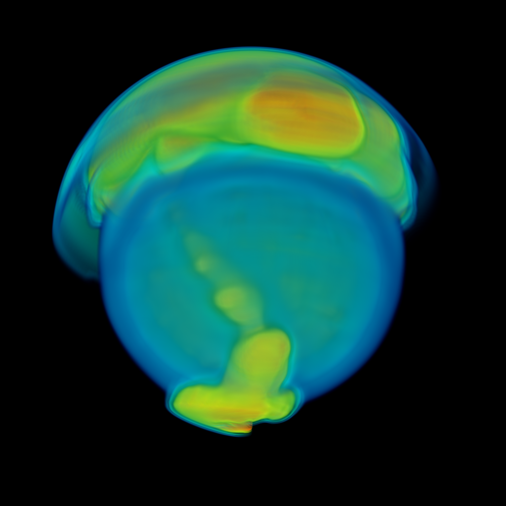

Instructions
------------

Performing this version of the project will earn you 25 points (out of 35
possible). Implement a ray-casting volume renderer that uses compositing
for its ray function. The volume renderer should work on rectilinear grids,
should be able to cast rays using perspective projection (i.e., like the
slides in class) from arbitrary camera positions. The specifications
(data set, transfer functions, camera positions, and image size) are posted
below. You should work with the data structures for a camera and a transfer
function posted to the web as part of the project, as the final images use
these specifications.  Your deliverables are two-fold:

    (1) your code
    (2) the image your code produces

# Solution
----------

